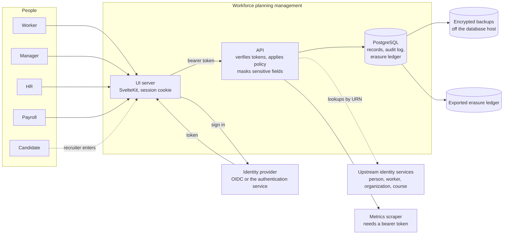

# Data-flow diagram (WPM-R92)

What enters the system, where it is stored, who can read it, and where it can go. Adapt it
to the deployer's own hosting, identity provider and processors.

| Flow | Data | Protection in the design | Deployer to decide |
| --- | --- | --- | --- |
| People to UI | Everything the user enters or reads | TLS (deployer's proxy); security headers and a content security policy; the session is an httpOnly cookie, never JavaScript-readable | TLS termination, network exposure |
| UI to identity provider | Sign-in credentials stay with the provider | WPM never holds a password, client secret or authorization code (WPM-D62) | Which provider, MFA policy |
| UI to API | A short-lived bearer token | Verified offline against the provider's published keys; issuer and audience checked; sign-in enforced by default | Key source, token lifetime |
| API to database | All records | Pure rules decide; sensitive fields masked by policy; every mutation and every read of a high-tier record audited | Database hosting, encryption at rest, access |
| API to upstream services | A URN (`person:<uuid>`) and a lookup | Identities are referenced, not copied; display names are refreshable caches | Whether the upstream services are used |
| Database to backups | A full copy | Custom-format dump, owner-only, checksummed; deleted after 35 calendar days by default | Where it is stored, encryption, who can read it |
| Database to exported ledger | A pid and a time per erasure | Holds no personal data once the person is erased | Where the file is kept |
| API to metrics scraper | Counts and timings, no personal data | Needs a bearer token | Who scrapes |

## What does **not** flow

- **Pulse survey responses** carry no author (WPM-D20): they cannot be tied to a person even by an administrator.
- **360 raters' comments** are not shown at rater level (WPM-D21).
- **Diagnoses, symptoms and health cohorts** have no column (WPM-D17, D24, D25).
- **Aggregates** name no one and withhold counts below a floor (WPM-D32).
- **No analytics, advertising or third-party scripts** are loaded by the UI (its content security policy would block them).

## Where data leaves the deployer's control

Only where the deployer chooses: the identity provider, the hosting provider, the backup
store, any mail relay. International transfers follow from where those are. The software
makes none of its own.
